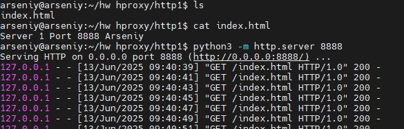
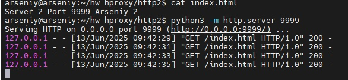
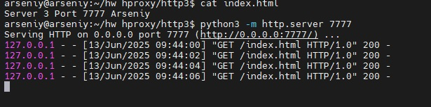
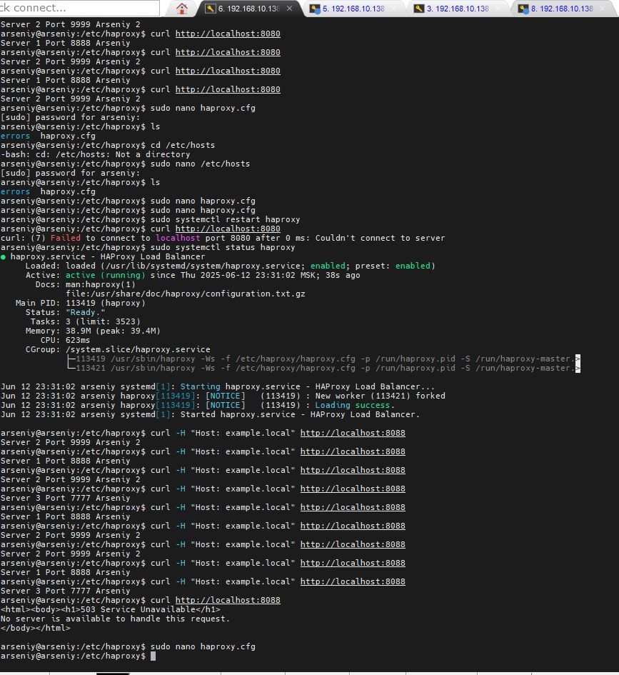
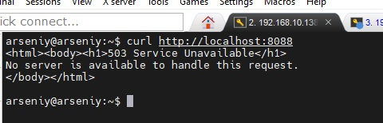

# Домашнее задание к занятию   
**"`Кластеризация и балансировка нагрузки`"** - `Воскобойников Арсений Петрович`
   
**Задание 1**  
``` 
Запустите два simple python сервера на своей виртуальной машине на разных портах
Установите и настройте HAProxy, воспользуйтесь материалами к лекции по ссылке
Настройте балансировку Round-robin на 4 уровне.
На проверку направьте конфигурационный файл haproxy, скриншоты, где видно перенаправление запросов на разные серверы при обращении к HAProxy.
``` 

**Ответ**
Запустим Python сервера на разных портах.


Установим и запустим Haproxy и проведем проверку при помощи curl http://localhost:8080

Видим что нам по очереди отвечают сначала первый севрер, потом второй.
Конфигурация [Haproxy задание 1](/haproxy_task1.cfg)

**Задание 2**  

```
Запустите три simple python сервера на своей виртуальной машине на разных портах
Настройте балансировку Weighted Round Robin на 7 уровне, чтобы первый сервер имел вес 2, второй - 3, а третий - 4
HAproxy должен балансировать только тот http-трафик, который адресован домену example.local
На проверку направьте конфигурационный файл haproxy, скриншоты, где видно перенаправление запросов на разные серверы при обращении к HAProxy c использованием домена example.local и без него.
``` 

**Ответ**

Проведём запуск 3 Python серверов на разных портах(7777, 8888, 9999).



Изменим конфигурацию Haproxy согласно заданию [Hparoxy задание 2](/haproxy_task2.cfg) настроив балансировку Round Robin на 7 уровне и задав веса серверам (смотри конфигурацию Haproxy).
Проведём проверку, отправляя http запросы с использованием домена example.local "curl -H "Host: example.local" http://localhost:8088" и без него "curl http://localhost:8088".

Видим что ответы чередуются мужду серверами.

При отправке запроса к серверу без указния домена, приходит ответ об отсутствии сервисов на данном адресе.