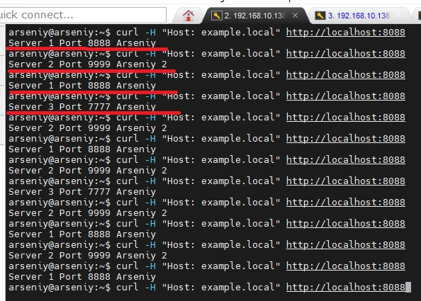

# Домашнее задание к занятию   
**"`Кластеризация и балансировка нагрузки`"** - `Воскобойников Арсений Петрович`
   
**Задание 1**  
``` 
Запустите два simple python сервера на своей виртуальной машине на разных портах
Установите и настройте HAProxy, воспользуйтесь материалами к лекции по ссылке
Настройте балансировку Round-robin на 4 уровне.
На проверку направьте конфигурационный файл haproxy, скриншоты, где видно перенаправление запросов на разные серверы при обращении к HAProxy.
``` 

**Ответ**
Запустим Python сервера на разных портах.


Установим Haproxy

Запустим Haproxy и проведем проверку при помощи http://localhost:8080

Видим что нам по очереди отвечают сначала первый севрер, потом второй.
Конфигурация [Haproxy](/haproxy.cfg)

**Задание 2**  

```
Запустите три simple python сервера на своей виртуальной машине на разных портах
Настройте балансировку Weighted Round Robin на 7 уровне, чтобы первый сервер имел вес 2, второй - 3, а третий - 4
HAproxy должен балансировать только тот http-трафик, который адресован домену example.local
На проверку направьте конфигурационный файл haproxy, скриншоты, где видно перенаправление запросов на разные серверы при обращении к HAProxy c использованием домена example.local и без него.
``` 

**Ответ**

Проведём запуск дополнительного Python сервера.
Изменим конфигурацию Haproxy. 
Проведём проверку. Запросы перенаправляются на разные серверы и только с использованием домена  example.local

Конфигурация [Hparoxy](/haproxy_task2.cfg)

